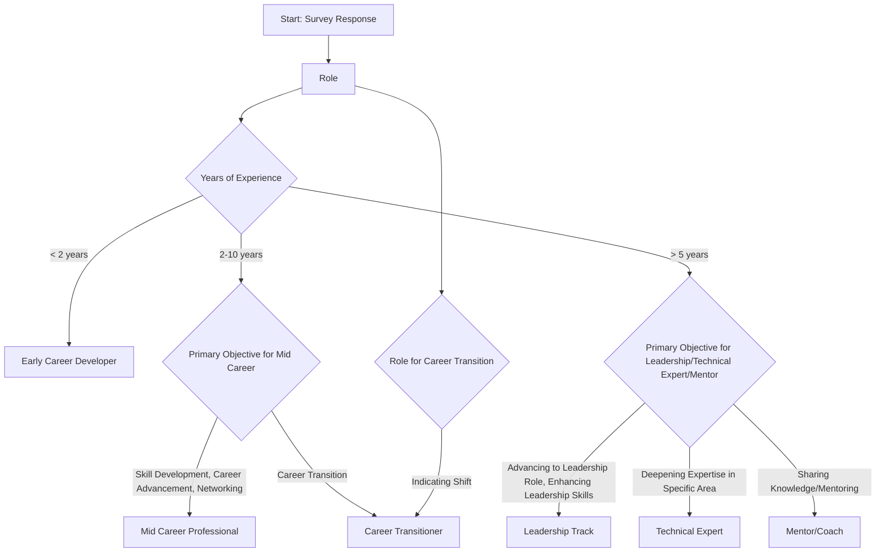

# Research

## Revised Survey Structure

### Part 1: Initial Broad Questions (Simplified and More Focused)

Current Role: [Multiple Choice]
"What is your current role?" (Options: Developer, Technical Leader, Mentor, etc.)
Professional Experience: [Multiple Choice]

"How many years of professional experience do you have in the tech industry?" (Options: <2 years, 2-5 years, 5-10 years, >10 years)

Primary Objective for Professional Development: [Multiple Choice]
"What is your primary objective for professional development?" (Options: Career Advancement, Skill Enhancement, Knowledge Sharing, Career Transition)

### Part 2: Behavioral-Based Questions

Past Learning Actions: [Multiple Choice]
"In the past year, how often have you engaged in learning activities outside your work scope?" (Options: Frequently, Occasionally, Rarely, Never)

Reaction to Professional Challenges: [Multiple Choice]
"When faced with a professional challenge, how do you typically respond?" (Options: Seek mentorship, Self-learn, Consult peers, etc.)

### Part 3: Simplified Ranking and Rating Questions

Professional Goals Priority: [Rating Scale]
Rate the importance of each goal: Career Advancement, Skill Development, Networking, Work-Life Balance. (Scale: 1-5)

Resource Preference: [Rating Scale]
"Rate how valuable you find each of the following resources for professional growth:" Online courses, Workshops, One-on-one mentoring, etc. (Scale: 1-5)

### Part 4: Streamlined Demographic Questions

Industry Sector: [Multiple Choice]
"Which sector best describes your current industry?" (Options: Software Development, IT Services, Education, etc.)

Company Size: [Multiple Choice]
"What is the approximate number of employees in your current organization?"
Options:
"1-10 (Startup)",
"11-50 (Small Enterprise)",
"51-200 (Medium Enterprise)",
"201-500 (Large Enterprise)",
"500+ (Corporation)"

### Part 5: Direct Product-Related Questions (For Hypothesis Testing)

Feature Interest: [Multiple Choice]
"Which features of a professional development platform are most appealing to you?" (Options: Mentorship Programs, Skill Tracking, Networking Opportunities, etc.)

Pricing Sensitivity: [Multiple Choice]
"What is your preferred pricing model for a professional development service?" (Options: Subscription-based, One-time fee, Free with premium features, etc.)

### Part 6: Final Engagement and Feedback
Willingness to Engage: [Yes/No]
"Would you be interested in receiving more information or a demo of our platform?"

Survey Feedback: [Open-Ended]
"Do you have any suggestions or feedback to improve this survey?"

### Key Improvements:

Reduced Cognitive Load: Simplified questions and limited ranking options reduce respondent fatigue.

Behavioral Focus: Inclusion of questions based on past behavior for more accurate data.

Direct Product Insights: Questions on product features and pricing provide actionable insights for sales strategies.

Demographic Contextualization: Expanded demographic questions for better segmentation and analysis.

Lead Generation: Final question for engagement to convert respondents into potential leads.

# Creating a Growth Summary from Assessment Data

To provide respondents with a summary that reflects their growth potential and areas for development, consider the following approach:

## Segmentation Based on Responses:

Use responses to categorize each participant into a growth segment (e.g., Early Career, Mid Career, Leadership Track, Career Transition).
This segmentation can be based on a combination of their role, years of experience, and primary professional objective.
Analysis of Learning Preferences and Challenges:

Evaluate their responses to learning preferences, challenges faced, and reaction to professional challenges.
This analysis will identify key areas where they seek growth and the type of resources they prefer for their development.
Personalized Growth Insights:

Based on the segmentation and analysis, create a personalized summary for each respondent.
This summary could include:
Growth Stage: A brief description of their current professional growth stage based on their experience and objectives.

### Key Growth Opportunities: 

Highlight specific areas for development and suggest potential pathways based on their responses (e.g., leadership skills for someone on the Leadership Track).

### Resource Alignment: 

Suggest resources or types of learning formats that align with their preferences and goals.

### Actionable Steps:

Provide actionable recommendations tailored to their growth segment.

For instance, for someone in the Early Career segment, recommend mentorship opportunities or skill-building courses in areas they've expressed interest.

### Link to Your Services:

Align the summary with the services offered by Tome.gg.
Show how your platform can support their identified growth areas and learning preferences.

### Feedback Loop for Continuous Improvement:

Include an option for them to provide feedback on the summary.
Use this feedback to continuously refine your assessment tool and the personal growth summaries.

## Delivering the Summary

The summary could be delivered as a follow-up email or as an instant report upon completing the survey, depending on your platform's capabilities.

Ensure the summary is visually appealing, easy to understand, and emphasizes the potential benefits of engaging with Tome.gg for their professional development.

# References

- https://chat.openai.com/c/1ca4aade-1fbe-40d4-8568-37857a9bb502